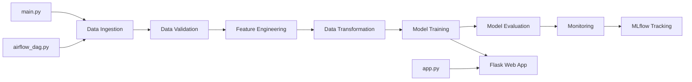

# ML Pipeline with Evidently AI Monitoring

End-to-end machine learning pipeline for road accident risk prediction with comprehensive monitoring, deployment, and CI/CD automation.

## Project Overview

This project implements a complete MLOps pipeline for predicting road accident risk using Gradient Boosting Regressor. The pipeline includes data ingestion, validation, transformation, feature engineering, model training, evaluation, and monitoring with Evidently AI.

## Architecture



## Pipeline Stages

### Stage 1: Data Ingestion
- Loads raw dataset from source
- Splits data into train and test sets
- Stores in artifacts directory

### Stage 2: Data Validation
- Validates schema and data types
- Checks for missing values
- Ensures data quality

### Stage 3: Feature Engineering
- Creates interaction features (lanes_speed, curvature_speed)
- Generates risk indicators (high_speed, few_lanes, no_signs)
- Builds categorical features (speed_category, curvature_category)

### Stage 4: Data Transformation
- Encodes categorical features using LabelEncoder
- Scales numerical features using StandardScaler
- Prepares data for model training

### Stage 5: Model Training
- Trains Gradient Boosting Regressor
- Performs hyperparameter tuning
- Saves trained model to artifacts

### Stage 6: Model Evaluation
- Evaluates model performance (MAE, RMSE, R2 Score)
- Logs metrics to MLflow
- Stores evaluation results

### Stage 7: Monitoring
- Generates data drift reports using Evidently AI
- Tracks model performance over time
- Creates interactive HTML dashboards

## Technologies Used

- **ML Framework**: scikit-learn
- **Monitoring**: Evidently AI
- **Experiment Tracking**: MLflow, DagsHub
- **Orchestration**: Apache Airflow
- **Web Framework**: Flask
- **Containerization**: Docker
- **CI/CD**: GitHub Actions
- **Deployment**: Kubernetes

## Project Structure

```
ML_PipeLine_Evidently/
├── src/heartpipeline/
│   ├── components/          # Pipeline components
│   ├── pipeline/            # Stage implementations
│   ├── config/              # Configuration management
│   ├── entity/              # Entity definitions
│   └── utils/               # Utility functions
├── config/                  # YAML configurations
├── artifacts/               # Generated artifacts
├── monitoring/              # Evidently monitoring
├── deployment/              # Kubernetes manifests
├── templates/               # Flask HTML templates
├── static/                  # CSS/JS/Images
├── .github/workflows/       # CI/CD pipelines
├── app.py                   # Flask web application
├── main.py                  # Pipeline executor
├── airflow_dag.py          # Airflow DAG definition
├── Dockerfile              # Container image
└── requirements.txt        # Python dependencies
```

## Features

### Web Application (app.py)
- Interactive prediction interface
- Real-time risk assessment (Low/Medium/High)
- Monitoring dashboard with drift reports
- REST API endpoints for predictions

### Orchestration (airflow_dag.py)
- Automated pipeline execution
- Task dependencies and scheduling
- Failure handling and retries

### Monitoring (Evidently AI)
- Data drift detection
- Model performance tracking
- Feature-level analysis
- Interactive visualizations

### MLflow Integration
- Experiment tracking
- Model versioning
- Metric logging
- DagsHub remote tracking

## Installation

### Clone Repository
```bash
git clone https://github.com/Abeshith/ML_PipeLine_Evidently.git
cd ML_PipeLine_Evidently
```

### Environment Setup (Linux/WSL)

#### 1. Copy Project to Linux Environment (Windows Users)
```bash
cp -r /mnt/d/ML\ PipeLine\ \(Evidently\) ~/
cd ~/ML\ PipeLine\ \(Evidently\)
```

#### 2. Install Python and Setup Virtual Environment
```bash
# Install Python3
sudo apt update
sudo apt install python3 python3-pip python3-venv

# Create virtual environment
python3 -m venv venv

# Activate virtual environment
source venv/bin/activate

# Install dependencies
pip install -r requirements.txt
```

#### 3. Configure Apache Airflow
```bash
# Set Airflow home directory
export AIRFLOW_HOME=~/airflow
echo $AIRFLOW_HOME

# Initialize Airflow database
airflow db init

# Configure authentication manager
vim ~/airflow/airflow.cfg
```

Edit the configuration file:
- Press `i` to enter insert mode
- Replace `auth_manager = airflow.api.fastapi.auth.managers.simple.simple_auth_manager.SimpleAuthManager`
- With `auth_manager=airflow.providers.fab.auth_manager.fab_auth_manager.FabAuthManager`
- Press `ESC` then type `:wq!` and press `ENTER`

```bash
# Create DAGs directory
mkdir -p ~/airflow/dags

# Copy DAG file to Airflow directory
cp airflow_dag.py ~/airflow/dags/

# Test DAG configuration
python ~/airflow/dags/airflow_dag.py
```

#### 4. Launch Airflow Webserver
```bash
# Start Airflow standalone mode
airflow standalone
```

#### 5. Execute Pipeline via Airflow UI
1. Open browser and navigate to: `http://0.0.0.0:8080`
2. Search for `ml_pipeline_dag` in the DAGs list
3. Click on the DAG and trigger execution
4. Monitor workflow progress through Airflow UI

## Usage

### Run Complete Pipeline
```bash
python main.py
```

### Run Flask Web App
```bash
python app.py
```
Access at: http://localhost:5000

### Run with Airflow
```bash
airflow dags trigger ml_pipeline_dag
```

### Run with Docker
```bash
docker build -t ml-pipeline .
docker run -p 5000:5000 ml-pipeline
```

## CI/CD Pipeline

GitHub Actions workflow automates:
1. **Checkout** - Retrieves code from repository
2. **Build** - Creates Docker images from application code
3. **Scan** - Performs security vulnerability scans with Trivy
4. **Deliver** - Pushes validated images to DockerHub registry

The pipeline triggers automatically on push to main branch.

## Kubernetes Deployment

### Local Deployment with Minikube

#### 1. Start Minikube Cluster
```bash
# Initialize Minikube cluster
minikube start
```

#### 2. Deploy Application
```bash
# Deploy application using deployment manifest
kubectl apply -f deployment/deployment.yaml

# Check pod status
kubectl get pods
```

#### 3. Deploy Services
```bash
# Apply service configuration
kubectl apply -f deployment/service.yaml

# Verify service deployment
kubectl get svc
```

#### 4. Access Application - Method 1 (Port Forwarding)
```bash
# Forward service port to local machine
kubectl port-forward svc/ml-pipeline-service 8000:80

# Access application in browser at:
# http://localhost:8000
```

#### 5. Access Application - Method 2 (Load Balancer)
```bash
# Edit service configuration
kubectl edit svc ml-pipeline-service

# Change service type from NodePort to LoadBalancer
# Press ESC, type :wq! and press ENTER to save

# Open new terminal and create tunnel
minikube tunnel

# In original terminal, check for external IP
kubectl get svc

# Access application using external IP (127.0.0.1) in browser
```

#### 6. Configure Ingress (Optional)
```bash
# Deploy ingress configuration
kubectl apply -f deployment/ingress.yaml

# Install Ingress Controller (nginx)
minikube addons enable ingress

# Check Ingress Controller pods
kubectl get pods -A | grep nginx

# Check Ingress deployment and get address
kubectl get ingress

# Configure local DNS
sudo vim /etc/hosts
```

Add the following lines to `/etc/hosts`:
```
127.0.0.1       localhost
192.168.49.2    ml-pipeline.example.com
```

Press `ESC`, type `:wq!` and press `ENTER` to save.

```bash
# Verify configuration
ping ml-pipeline.example.com

# Access application via domain
# http://ml-pipeline.example.com
```

### Production Deployment
```bash
kubectl apply -f deployment/deployment.yaml
kubectl apply -f deployment/service.yaml
kubectl apply -f deployment/ingress.yaml
```

## Model Details

- **Algorithm**: Gradient Boosting Regressor
- **Features**: 12 input features + 10 engineered features
- **Target**: accident_risk (continuous)
- **Metrics**: MAE, RMSE, R2 Score

### Input Features
- road_type, num_lanes, curvature, speed_limit
- lighting, weather, road_signs_present, public_road
- time_of_day, holiday, school_season, num_reported_accidents

## API Endpoints

### Prediction
```bash
POST /api/predict
Content-Type: application/json

{
  "road_type": "highway",
  "speed_limit": 60,
  "num_lanes": 2,
  ...
}
```

### Dashboard
- `/` - Home page
- `/predict` - Prediction form
- `/dashboard` - Monitoring dashboard
- `/reports/drift` - Data drift report
- `/reports/performance` - Performance metrics

## Monitoring Dashboard

Access Evidently AI reports:
- Data Drift Analysis
- Feature Distribution Changes
- Model Performance Metrics
- MLflow Experiments: https://dagshub.com/abheshith7/ML-Pipeline-Evidently.mlflow

## Configuration

Edit `config/config.yaml` for pipeline settings:
- Artifact paths
- Model parameters
- Data sources

## Contributing

1. Fork the repository
2. Create feature branch
3. Commit changes
4. Push to branch
5. Create pull request